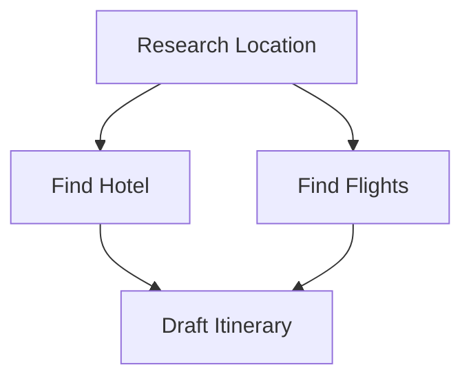

# Orchestrator Logic: The Graph Execution Engine

## 1. Overview
The Orchestrator does not execute tasks itself. It is a **Planner**.
1.  **Input:** User Goal ("Book a flight").
2.  **Process:** LLM decomposes this into a DAG (Directed Acyclic Graph).
3.  **Output:** A `TaskGraph` object passed to the `GraphExecutor`.

## 2. The Task Graph Structure
Dependencies ensure agents don't start before their inputs are ready.

## 3. The Execution Loop (GraphExecutor)
The `GraphExecutor` runs on a dedicated thread loop:
1.  **Check Readiness:** `graph.getReadyTasks()`
2.  **Resource Check:** `resourceManager.acquire(Chrome)`
3.  **Spawn:** Create `ExploratoryAgent` for the task.
4.  **Monitor:** Wait for `Message.TaskComplete` or `Message.ErrorOccurred`.

## 4. Dynamic Replanning
If a node fails (e.g., "Find Hotel" fails 5 times):
1.  `GraphExecutor` pauses the graph.
2.  It notifies the `Orchestrator`.
3.  `Orchestrator` asks LLM: "Task B failed. Here is the error. Re-plan?"
4.  LLM returns a **Patch**: "Replace Task B with Task B_Alternative (Search Airbnb instead of Booking.com)".
5.  `GraphExecutor` resumes with the modified graph.